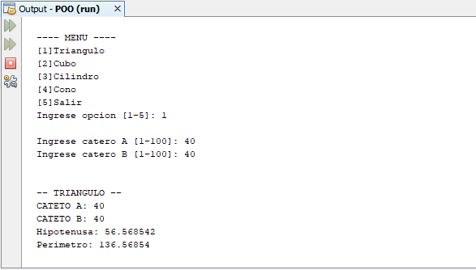

# Formulas trigonométricas básicas
Sistema de formulas trigonométricas básicas de perímetro e hipotenusa de un triangulo, área lateral, área total y volumen de un cubo, área lateral, área total y volumen de un cilindro y área lateral, área total y volumen de un cono con programación orientada a objetos(POO), **13/11/19**.

<strong>Imagen:</strong> Menú principal - Triangulo.

